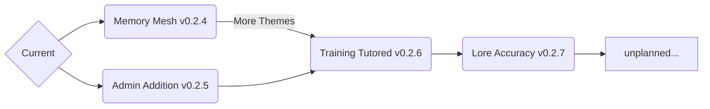

# Future Ideas
This is a list of ideas we would like to add to Bloxd Agent Blue. Contact us on Reddit or Bloxdhub if you would like to suggest anything.

## Planned Timeline

### Memory Mesh (v0.2.4)
Introduces a panel that allows users to select one, multiple, or all chats, and once submitted, the AI, for *one response only*, will remember content from the selected chat(s) and will use the content to generate a response to the user's prompt. Currently in alpha, releases April 30th-March 3rd.
### Admin Addition (v0.2.5)
Updates trainer controls. Trainers will now be able to request any memory deletes. They may also reintoduce any deleted training notes. The 'Trainer' list will also be cleaned up to show actual trainers at the top, and uses who have requested to train the AI will be shown on the bottom. Releases around or after the release of `Memory Mesh`.
### Training Tutored (v0.2.6)
The AI will go through RLHF training for a second time. It will also use notes similar to the training notes used by Antropic for Claude, OpenAI for ChatGPT, and Google for Gemini. Releases sometime in June.
### Lore Accuracy (v0.2.7)
The AI will have new info on the history on Bloxd.io, Bloxdhub, and itself. It will also have knowledge on any fanon lore about the game Bloxd.io. Releases sometime June-September.
